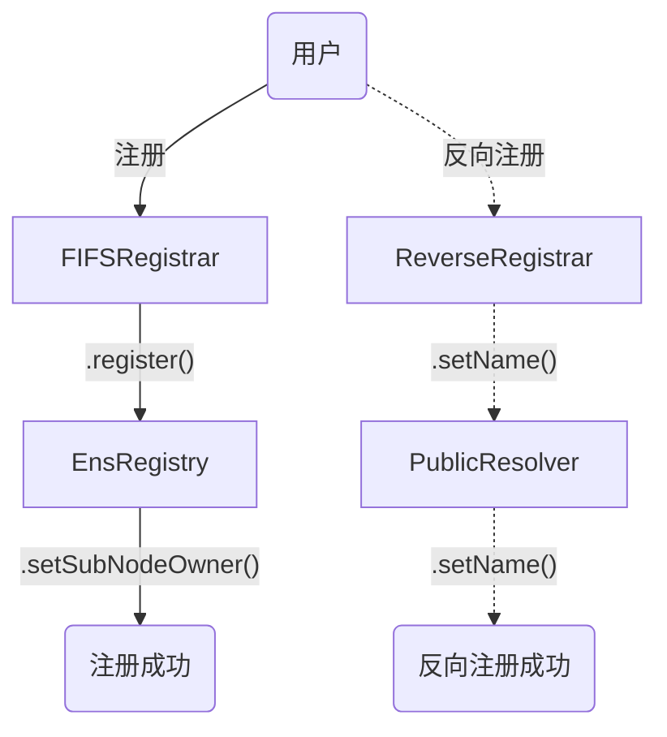
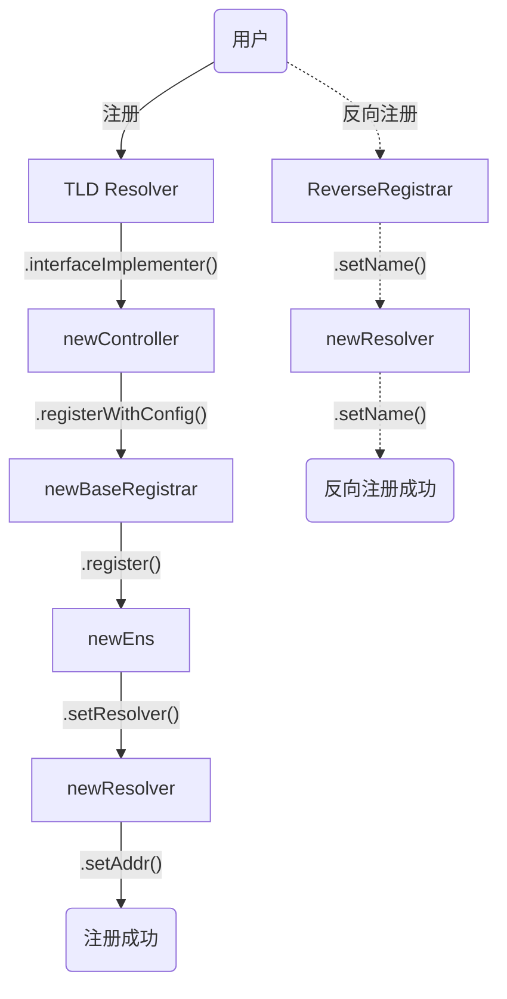
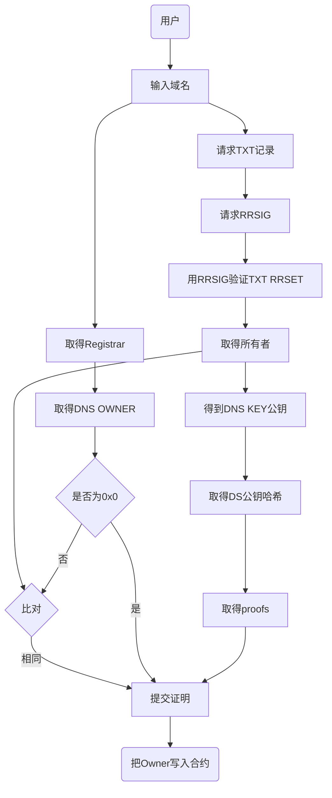

# 关于ENS合约

## A 最简部署方案

01. 注册表：EnsRegistry
02. 解析器：PublicResolver(EnsRegistry)，需要在注册表中查询域名的所有权，因此部署解析器时需要用到注册表的地址作为参数
03. 注册中心：FIFSRegistrar(EnsRegistry, TLD)，部署注册中心合约，并将其设置为顶级域名的所有者。
04. 反向注册中心：ReverseRegistrar(EnsRegistry, PublicResolver)

### 注册与反向注册业务流：

## B 适配ens-app前端的，必须部署的合约

### B.1 第一部分 旧合约

01. 旧注册表：ens
02. ~~旧解析器1：oldResolver(ens)~~
03. 旧解析器2：resolver(ens)：另一个解析器，意味着不同的合约版本。
04. ~~旧反向注册中心：oldReverseRegistrar(ens, resolver)~~
05. 旧拍卖合约：legacyAuctionRegistrar：拍买相关合约，该功能可能已在前端被隐藏。但目前仍用于作为部署一步合约的参数。
06. 旧注册中心：oldBaseRegistrar(ens, legacyAuctionRegistrar, TLD)
07. 旧价格预言机：priceOracle，价格单位是1ETH。
08. 旧控制器：controller</a>(oldBaseRegistrar, priceOracle)
09. 旧解析器2设置接口：通过resolver.setInterface(interfaceID, controller</a>)设置接口，用户可以更换实现ERC165的其它控制器。接口interfaceID可能包括：
    - legacyRegistrar: '0x7ba18ba1', 
    - permanentRegistrar: '0x018fac06', 
    - permanentRegistrarWithConfig: '0xca27ac4c', 
    - baseRegistrar: '0x6ccb2df4', 
    - linearPremiumPriceOracle: '0x5e75f6a9'
10. 旧子域名注册中心：oldSubdomainRegistrar(ens)，用于兼容旧版合约。
11. 旧迁移子域名注册中心：ensMigrationSubdomainRegistrar(ens)，用于兼容旧版合约。

### B.2 第二部分 新合约

01. 新注册表：newEns(ens)，用旧注册表地址注册新注册表
02. 新注册中心：newBaseRegistrar(ens, TLD)
03. 新价格预言机，newPriceOracle，根据需求可能是`linearPremiumPriceOracle`或`exponentialPremiumPriceOracle`两种不同的合约。这两种合约部署时都需要另外一个oracle合约以实时读取本币的美元价格。
04. 新控制器：newController(newBaseRegistrar, newPriceOracle);
05. 新解析器：newResolver(newEns)
06. 新续费合约：newBulkRenewal(newEns)，用于下一步设置解析器接口，不会独立使用。
09. 新解析器设置接口：通过newResolver.setInterface(interfaceID, controller</a>)设置接口，用户可以更换实现ERC165的其它控制器。
07. 新反向注册中心：newReverseRegistrar(newEns, newResolver)

### B.3 第三部分 Migration

registrarMigration(oldBaseRegistrar, newBaseRegistrar, oldSubdomainRegistrar, ensMigrationSubdomainRegistrar)

### B.4 注册与反向注册业务流

注册，renewal等业务遵循类似的业务流程，即通过控制器合约进行代理。

## DNSSEC验证流程

